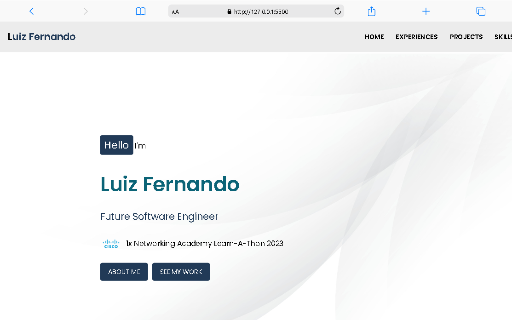

<h1 align="center" style="font-weight: bold;">Personal Portfolio 💻</h1>
<div id="technologies" align="center">
    
    

<p align="center">
    <a href="#technologies">Technologies Used</a> •
  <a href="#structure">Structure</a> •
 <a href="#contribute">Contribute</a>
</p>

<p align="center">
    <b>This portfolio is a representation of my journey as a future software engineer. In it, you will find detailed sections about my professional experiences, projects carried out and technical skills.</b>
</p>

<p align="center">
     <a href="https://luizddev.github.io/portfolio/">📱 Visit this Project</a>
</p>

<h2 id="layout">🎨 Layout</h2>

<p align="center">
    
    
</p>

<h3>Cloning</h3>

How to clone your project

```bash
git clone https://github.com/SeuUsuario/portfolio-luiz-fernando.git
```

<h3>Starting</h3>

How to start your project

```bash
cd portfolio-luiz-fernando
```
<h3>Open the archive</h3>
 - You can simply drag the `index.html` file into an open browser window or
 - Double click on the `index.html` file to open directly in the default browser.

<h2 id="structure">💻 Project Structure</h2>

```
/project-root
│
├── index.html
├── style.css
└── imgs/
    ├── project images
```

<h2 id="contribute">📫 Contribute</h2>

1. `git clone https://github.com/Luizddev/index.html`
2. `git checkout -b feature/NAME`
3. Follow commit patterns
4. Open a Pull Request explaining the problem solved or feature made, if exists, append screenshot of visual modifications and wait for the review!

<h3>Documentations that might help</h3>

[📝 How to create a Pull Request](https://www.atlassian.com/br/git/tutorials/making-a-pull-request)

[💾 Commit pattern](https://gist.github.com/joshbuchea/6f47e86d2510bce28f8e7f42ae84c716)
