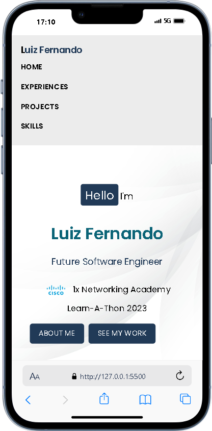
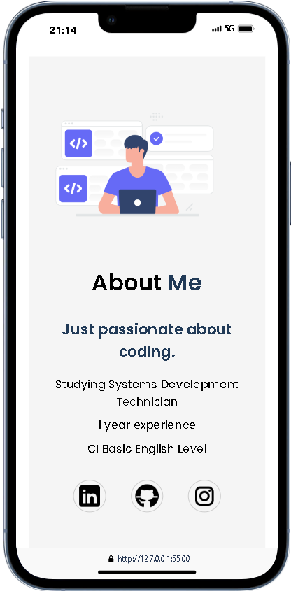
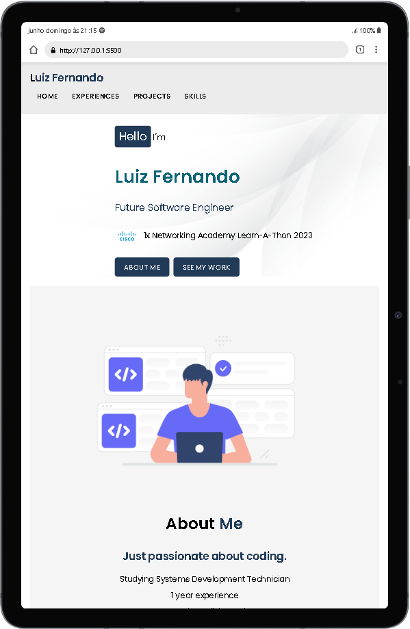

# Portfólio de Luiz Fernando

Bem-vindo ao repositório do meu portfólio! Este projeto foi criado para apresentar minhas habilidades, experiências e projetos. Aqui você encontrará uma visão geral do meu trabalho e minhas conquistas.

## Índice

- [Visão Geral](#visão-geral)
- [Tecnologias Utilizadas](#tecnologias-utilizadas)
- [Estrutura do Projeto](#estrutura-do-projeto)
- [Como Visualizar](#como-visualizar)
- [Próximas Melhorias](#próximas-melhorias)
- [Contato](#contato)

## Visão Geral

Este portfólio é uma representação do meu percurso como futuro engenheiro de software. Nele, você encontrará seções detalhadas sobre minhas experiências profissionais, projetos realizados e habilidades técnicas.

## Tecnologias Utilizadas

- **HTML5**: Estruturação do conteúdo.
- **CSS3**: Estilização e layout da página.
- **Google Fonts**: Tipografia com a fonte "Poppins".
- **Ícones e Imagens**: Utilização de ícones e imagens relevantes para enriquecer a experiência visual.

## Estrutura do Projeto

A estrutura de arquivos do projeto é organizada da seguinte forma:

```
/project-root
│
├── index.html
├── style.css
└── imgs/
    ├── favicon.ico
    ├── CiscoCertified.png
    ├── image.png
    ├── linkedin-logo.png
    ├── github-logo.png
    ├── instagram-logo.png
    └── fundo.jpg
```

- **index.html**: Contém a estrutura HTML do portfólio.
- **style.css**: Contém os estilos CSS aplicados ao portfólio.
- **imgs/**: Diretório que armazena todas as imagens utilizadas no site, incluindo ícones e logos.

## Como Visualizar

Para visualizar o portfólio localmente, siga estas etapas:

1. **Clone este repositório**:
    ```sh
    git clone https://github.com/SeuUsuario/portfolio-luiz-fernando.git
    ```
2. **Navegue até o diretório do projeto**:
    ```sh
    cd portfolio-luiz-fernando
    ```
3. **Abra o arquivo `index.html` em seu navegador**:
    - Você pode simplesmente arrastar o arquivo `index.html` para uma janela aberta do navegador ou
    - Clicar duas vezes no arquivo `index.html` para abrir diretamente no navegador padrão.
  
 **Ou abra o link abaixo**:
    - <a href="https://luizddev.github.io/portfolioluizddev/">Link do Portfólio</a>

## Próximas Melhorias

Aqui estão algumas melhorias planejadas para este portfólio:

1. **Alteração do Tema**: Implementar um tema escuro para melhorar a experiência do usuário, permitindo a troca entre os temas.
2. **Animações e Interatividade**: Adicionar animações sutis e interações para tornar a navegação mais envolvente.
3. **SEO e Performance**: Melhorar o SEO e otimizar a performance para um carregamento mais rápido das páginas.
4. **Novos Projetos e Experiências**: Atualizar a seção de projetos com novos trabalhos e adicionar novas experiências profissionais conforme forem surgindo oportunidades.

## Foto do projeto

Visão Mobile:

 

 

 Visão Tablet:

 

  Visão Desktop:

 

## Contato

- **LinkedIn**: [linkedin.com/in/luizfernandoa](https://www.linkedin.com/in/luizfernandoa/)
- **GitHub**: [github.com/Luizddev](https://github.com/Luizddev)
- **Instagram**: [instagram.com/luizsog](https://www.instagram.com/luizsog/)

---

### Agradeço por visitar meu portfólio!
